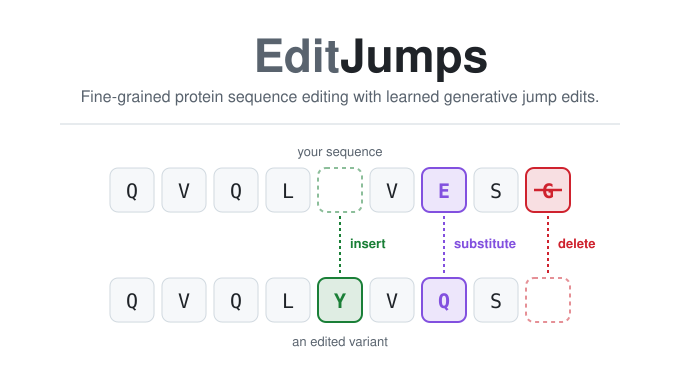

<div align="center">

<picture>
  <source media="(prefers-color-scheme: dark)" srcset=".github/images/hero-dark.svg">
  <source media="(prefers-color-scheme: light)" srcset=".github/images/hero-light.svg">
  
</picture>

<p>
  <a href="LICENSE"></a>
  
  
  <a href="https://arxiv.org/abs/2603.11703"></a>
</p>

</div>

<!--
  Every badge above is STATIC: shields.io renders the text and never reads this repository.
  That is deliberate. This repo is private, so shields.io and GitHub's camo proxy both fetch it
  anonymously, get a 404, and render a broken badge. Anything live -- CI status, latest tag,
  release, coverage -- will not work until the repo is public. When it is, add:

    <a href="https://github.com/<anonymous>/editjumps/actions/workflows/ci.yml">/editjumps/actions/workflows/ci.yml/badge.svg"></a>

  and switch the version badge to read the tag rather than a hardcoded string. No PyPI badge: the
  package is deliberately unpublished and pyproject carries `Private :: Do Not Upload` to enforce it.
-->

**Give one antibody or protein sequence in. Get near neighbours of it back** — a handful of
insertions, deletions and substitutions, placed where related natural sequences actually differ.
You set roughly how many edits you want.

<table>
<tr>
<td width="190" valign="top">
  <picture>
    <source media="(prefers-color-scheme: dark)" srcset=".github/images/feller-dark.svg">
    <source media="(prefers-color-scheme: light)" srcset=".github/images/feller-light.svg">
    
  </picture>
</td>
<td valign="top">

> *"In a small time interval there is an overwhelming probability that the state will remain
> unchanged; however, if it changes, the change may be radical."*

Feller, W. (1949). "On the Theory of Stochastic Processes, with Particular Reference to
Applications". *Proceedings of the (First) Berkeley Symposium on Mathematical Statistics and
Probability*. Vol. 1. University of California Press. pp. 403–432.

</td>
</tr>
</table>

## Overview

- **Local sequence variation:** Proposes candidate neighbours of an existing lead sequence with a small number of insertions, deletions, and substitutions for experimental evaluation.
- **Unconditional generation:** Generates plausible variants without scoring against a specific target property; downstream assays determine variant fitness.

### Comparison with Alternatives

- **Masked language models:** Infilling models operate on fixed-length masks and only propose substitutions. This editor supports insertions and deletions: across 400 evaluated variants per family, roughly half exhibited length changes (195/400 on Ty1 at 4.58 mean edits, 198/400 on HER2-VH at 4.08 mean edits; see [`metrics/disjoint/`](metrics/disjoint)).
- **Random mutagenesis:** Mutagenesis libraries vary positions arbitrarily. Here, edits follow distributions learned from homologous natural sequences.
- **MSA generators:** Multiple sequence alignment generators require full alignments and generate entire sequences. This model edits an individual sequence directly to stay within a specified edit budget.

### Reproduction Scope

This repository provides an independent reproduction of the EvoFlows edit-flow generator evaluated under the §4.2 protocol on two seed families (Ty1 and HER2-VH). Each comparison cell measures 400 generated sequences against a 200-sequence natural holdout across six methods. Results are traceable to files in [`metrics/`](metrics/).

All 14 pipeline stages are classified under `reproduction` in `editjumps/core/provenance.py` (documented in [`docs/claims.md`](docs/claims.md) and [`docs/findings.md`](docs/findings.md)). EvoFlows generation is unconditional; no target property guidance is implemented.

## Quick Start

### 1. Installation

```bash
uv sync --all-groups
```

> [!TIP]
> Run `uv run editjumps` on its own to list every available command, or add `--help` to any
> command (e.g. `uv run editjumps edit --help`) to see its full flag list with descriptions
> and defaults, straight from the source.

### 2. Minimal Local Loop: Train, Track & Evaluate (DVC & MLflow)

Run a fast, self-contained training and evaluation cycle locally on CPU or Apple Silicon (MPS). All hyperparameters, training loss curves, and evaluation metrics are automatically logged to **MLflow** and versioned with **DVC**.

#### Step 1: Launch Local MLflow Tracking

Start the local MLflow tracking server in the background (or a separate terminal):

```bash
make mlflow-ui
# Live dashboard: http://127.0.0.1:5555
```

> [!NOTE]
> All commands automatically log to `sqlite:///mlflow.db`. No cloud setup or credentials are required.

#### Step 2: Fetch Base Trunk & Prepare Data

Download the lightweight base ESM-2 trunk (35M parameters, UR50D):

```bash
uv run editjumps fetch-base-checkpoint
```

Prepare a minimal set of antibody homolog pairs (downloads 1 OAS study unit and clusters pairs in ~10 seconds):

```bash
uv run editjumps download-oas --max-units 1 --pair-chains --emit-cdr-keys
bash editjumps/core/install_mmseqs.sh
uv run editjumps build-homolog-pairs
```

- `--max-units`: caps how many OAS data units are downloaded; omit to fetch all (kept small here just to run fast)
- `--pair-chains`: emit each antibody as a single VH+VL line instead of one line per chain
- `--emit-cdr-keys`: also write CDR-H3/L3 keys per line, needed for later corpus splitting; requires `--pair-chains`

#### Step 3: Run Minimal Training

Run a 50-step jump-editor training loop on homolog pairs:

```bash
uv run --group train editjumps train-edit-flows \
  --pairs data/pretrain/oas_homolog_pairs.tsv.gz \
  --model-name data/pretrain/base_checkpoints/esm2_t12_35M_UR50D \
  --output-folder data/pretrain/edit_flows \
  --rate-head linear --q-head fresh \
  --max-steps 50 --batch-size 2
```

- `--pairs`: homolog pairs file to train on (produced by `build-homolog-pairs` in Step 2)
- `--model-name`: ESM-2 trunk to initialize from — local path or Hugging Face id (produced by `fetch-base-checkpoint` in Step 2)
- `--output-folder`: where the trained checkpoint is written
- `--rate-head`: which network computes how likely an edit is at each position — `linear` (a single linear layer) or `mlp` (a small 2-layer network, more expressive but more parameters). This choice gets baked into the checkpoint: any later command that loads it (`edit`, `generation-eval`) must pass the same value back
- `--q-head`: which network computes the amino acid to insert or substitute at an edited position — `fresh` (a new layer trained from scratch) or `esm_lm_head` (reuses ESM-2's own pretrained masked-language-model output head). Also baked into the checkpoint; must match on every later use
- `--max-steps`: number of training steps to run
- `--batch-size`: homolog pairs summed per optimizer step

> [!TIP]
> **DVC Pipeline Execution:** You can also run the version-controlled DVC stage defined in [`dvc.yaml`](dvc.yaml):
> ```bash
> uv run dvc repro -s train_edit_flows
> ```
> Hyperparameters (`max_steps`, `batch_size`, `lr`, etc.) are tracked and configurable in [`params.yaml`](params.yaml).

#### Step 4: Evaluate Generations

Score the trained editor against held-out homologs to compute Appendix B generation metrics (Levenshtein distance, covariance agreement, spectrum MMD, naturalness, diversity):

```bash
# Extract seed family reference holdouts
uv run editjumps seed-homologs

# Evaluate generation metrics
uv run --group train editjumps generation-eval \
  --model-folder data/pretrain/edit_flows \
  --pairs data/pretrain/oas_homolog_pairs.tsv.gz \
  --family-fasta data/interim/seed_families/Anti-SARS-CoV-2_VHH_Ty1.fasta \
  --rate-head linear --q-head fresh \
  --n-templates 5 --n-variants 5 --n-steps 10 --holdout-size 20 \
  --allow-train-overlap \
  --metrics-path metrics/generation_eval.json
```

- `--model-folder`: trained checkpoint to evaluate
- `--pairs`: homolog pairs file used to draw evaluation templates from (produced by `build-homolog-pairs` in Step 2)
- `--family-fasta`: one seed protein family's FASTA; enables the paper's holdout-based evaluation (produced by `seed-homologs`, run just above)
- `--rate-head` / `--q-head`: must match the values used when this checkpoint was trained with `train-edit-flows` (Step 3 above) — see there for what they control
- `--n-templates`: number of template sequences drawn from `--pairs` to generate variants from
- `--n-variants`: number of variants generated per template
- `--n-steps`: Euler sampling steps per generation (more steps = closer to the true continuous-time process, but slower)
- `--holdout-size`: number of natural sequences held out from the family to score generated variants against
- `--allow-train-overlap`: allows the training pairs to overlap the reference/holdout sequences; only for quick smoke runs like this one — real results need a disjoint holdout
- `--metrics-path`: where the computed metrics are written as JSON

Or run the standardized evaluation suite:
```bash
uv run editjumps evaluate --steps editor --allow-train-overlap
```

#### Step 5: Generate Candidate Edits

Propose variants of your antibody or protein sequence using your trained checkpoint:

```bash
uv run --group train editjumps edit \
  --sequence QVQLVESGGGLVKPGGSLRLSCAASGFTFSDYYMSWIRQAPGKGLEWVSYISSSSSYTNYADSVKGRFTISRDNAKNSLYLQMNSLRAEDTAVYYCAREGILGSGYYSVDYWGQGTLVTVSS \
  --model data/pretrain/edit_flows \
  --rate-head linear --q-head fresh \
  --n 5 --edits 5
```

- `--sequence`: amino-acid string, or a path to a single-record FASTA
- `--model`: model folder to load the trained checkpoint from
- `--rate-head` / `--q-head`: must match the values used when this checkpoint was trained with `train-edit-flows` (Step 3 above) — see there for what they control
- `--n`: how many sequence variants to generate
- `--edits`: approximate mean number of edits per variant
- `--clock`: clock value passed straight to the sampler, overriding `--edits` and skipping calibration
- `--json`: emit machine-readable JSON on stdout instead of the formatted table above

Pretrained weights are not bundled with the repository: if `--model` is omitted, `edit` looks in `data/pretrain/edit_flows_restored` (written by `editjumps restore-editor`); if no checkpoint is found there either, train one locally with Step 3 above or pass `--model` explicitly. See [`docs/weights.md`](docs/weights.md) for details.

`--edits` only requests a target — the sampler actually controls step size via EvoFlows' clock normalization, scaling edit rates by `clock / len(x)`, and realized edit counts vary around that target. `edit` calibrates the clock for you using a probe sequence; read each variant's `edit_distance` for the actual count, or set the clock directly with `--clock` instead.

Note that unconditional editing like this returns variants and edit distances only — no fitness or quality score. Scoring needs reference holdout sequences from the sequence's protein family (see `--family-fasta` in Step 4, or `editjumps rank` below).

This is what the output should look like:
```
input   122 aa
model   data/pretrain/edit_flows  (rate_head=linear, q_head=fresh, sampler=euler)
budget  clock 50.5 (from --edits 5 via lambda_bar 0.099, uncalibrated)
edits   realised mean 7.0, range 6-8

  0    6 edits  QVQLVESGGGLVKPGGSLRLSCAASGFTFSDYYMSWIRQAPKGLEWVSYISSSSSLTNYADSVKRFTISRDNAKNSLYQMNSLRAEDTAVYYCAREGILGSGVASVDYWGQGTLVTVSS
  1    7 edits  QVQLVESGGGLVKPGGSLRLSCAASGFTFSDYYMSVRRQAPGKGLEWVSYISSSSSYTNYADSVKGRFTFSRDNAKNSLYLQMNSLRASDAAVYYCAREGIVGSGYYSVDYWGQGMLVTVSS
  2    8 edits  QVQLVSSGGGLVKPGSLRLSCAASGFRFSDKMSWIRQAPGKLLEWVSYISSSSSYTNYADSVKGRFTISRDNAKNSLYLQMNSLRAEDNAVYYCAREGILGSGYYSVFYWGQGTLVTVSS
```

If you'd rather run this from Python than the CLI, the same call as above, as a script — save it as e.g. `generate.py` and run with `uv run --group train python generate.py`:

```python
from editjumps import edit

for v in edit("QVQLVESGGGLVKPGGSLRLSC...", model="data/pretrain/edit_flows", rate_head="linear", q_head="fresh", n=5, edits=5):
    print(v.edit_distance, v.sequence)
```

## Ranking Candidates

To score and rank candidate sequences by pseudo-likelihood under a reference protein language model:

```bash
uv run --group train editjumps rank \
  --sequence QVQLVESGGGLVKPGGSLRLSCAASGFTFSDYYMSWIRQAPGKGLEWVSYISSSSSYTNYADSVKGRFTISRDNAKNSLYLQMNSLRAEDTAVYYCAREGILGSGYYSVDYWGQGTLVTVSS \
  --sequence QVQLVESGGGLVKPGGSLRLSCAWSGFTFSDYYMSWIRQAPGKGLEWVSYISSSSSYTNYADSVKGRFTISRDNAKNSLYLQMNSLRAEDTAVYYCAREGILGSGYYSVDYWGQGTLVTVSS \
  --sequence QVQLVESGGGLVKPGGSLRLSCAASGFTFSDYYMSWIRQAPGKGLEWVSCISSKSSYTNYADSVKGRFTISRDNAKNSLYLQMNSLRAEDTAVYYCATEGILGSGYYSSDYWGPGTLVTVSS \
  --sequence SLATALDCQLGRVLGGSRINYDGLGVEISYSSQWANLGYNSVSFSRKTPSCDVYGWLSVGMSENTSDFSGGYYVQSVVSGMRYSSFQLPSLERAKAGYSARSTTYGYKAWILKTGAEDQYIV

uv run --group train editjumps rank --fasta candidates.fasta   # or from a file
uv run --group train editjumps rank --fasta candidates.fasta --json   # machine-readable
```

- `--sequence`: a candidate sequence; repeat the flag for more than one
- `--fasta`: a FASTA file of candidates, instead of repeating `--sequence`
- `--scorer`: which ESM-2 model to score with (default `facebook/esm2_t33_650M_UR50D`)
- `--max-positions`: positions scored per sequence; 0 scores all
- `--seed`: seed for the random masking order used by the Appendix B.2 pseudo-log-likelihood estimator
- `--json`: emit machine-readable JSON on stdout instead of the formatted ranking table below

Scoring uses ESM-2 and requires the `train` dependency group (~2.5 GB download for the default 650M model; `--scorer facebook/esm2_t12_35M_UR50D` is smaller).

The output should look something like this:
```
scorer  facebook/esm2_t33_650M_UR50D
metric  ESM-2 pseudo-log-likelihood, mean per position over 40 positions (higher = more natural)
ranked  4 candidates

   1  -0.6779  (input #0)  QVQLVESGGGLVKPGGSLRLSCAASGFTFSDYYMS…   natural VH
   2  -0.6976  (input #1)  QVQLVESGGGLVKPGGSLRLSCAWSGFTFSDYYMS…   + 1 substitution
   3  -0.7752  (input #2)  QVQLVESGGGLVKPGGSLRLSCAASGFTFSDYYMS…   + 5 substitutions
   4  -2.8617  (input #3)  SLATALDCQLGRVLGGSRINYDGLGVEISYSSQWA…   scrambled
```

This ranks naturalness according to ESM-2 pseudo-log-likelihood using the estimator from EvoFlows Appendix B.2. It scores sequence plausibility under a general PLM, not a specific functional assay property. Unlike `edit`, `rank` runs against standard public ESM-2 weights without custom checkpoints.

## Documentation

| Document | Description |
| --- | --- |
| [Installation](docs/installation.md) | Prerequisites, dependency groups, Python requirements |
| [Weights](docs/weights.md) | Checkpoint availability and restoration |
| [Model cards](docs/model_cards/README.md) | Model architectures, training data, and hyperparameters |
| [Training](docs/training.md) | Local and distributed training procedures |
| [Reproducing the paper](docs/reproducing.md) | Step-by-step reproduction of §4.2 and §4.3 evaluations |
| [Which claim is which](docs/claims.md) | Claim classification across pipeline stages |
| [Configuration](docs/configuration.md) | Target, comparability, and arm configurations |
| [Pipeline](docs/pipeline.md) | DVC DAG and stage definitions |
| [Common tasks](docs/common_tasks.md) | Common `make` targets |
| [Repository layout](docs/repository_layout.md) | Codebase directory structure |
| [Performance](docs/performance.md) | Throughput, compute, and hardware benchmarks |
| [Known issues](docs/known_issues.md) | Known issues, pitfalls, and workarounds |
| [What it does not do](docs/limitations.md) | Scope, non-goals, and limitations |
| [Findings](docs/findings.md) | Measured experimental results and logs |
