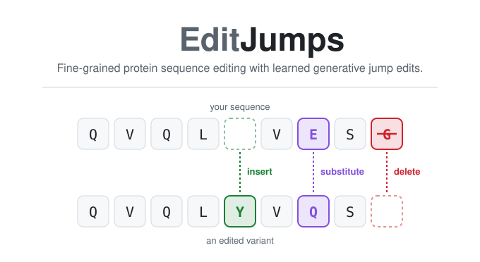

<div align="center">

<picture>
  <source media="(prefers-color-scheme: dark)" srcset=".github/images/hero-dark.svg">
  <source media="(prefers-color-scheme: light)" srcset=".github/images/hero-light.svg">
  
</picture>

<p>
  <a href="https://github.com/VisiumCH/editjumps/actions/workflows/ci.yml"></a>
  <a href="LICENSE"></a>
  <a href="pyproject.toml"></a>
  
  <a href="https://arxiv.org/abs/2609.18745"></a>
  <a href="https://arxiv.org/abs/2609.18745"></a>
  <a href="https://arxiv.org/abs/2603.11703"></a>
  <a href="https://arxiv.org/abs/2506.09018"></a>
  <a href="https://huggingface.co/VisiumSA/EditJumps"></a>
</p>

### [When Edit Flows are Edit Jumps: replicating Edit Flows and EvoFlows](https://arxiv.org/abs/2609.18745)

**NeurIPS 2026 Workshop AIDaR**

Gabriel Bénédict · Melanie Buechler · Gerard Riera-Solà · Chloé de Ancos ·
Yves Gaetan Nana Teukam · Moritz Freidank — Visium

Edit Flows and EvoFlows are one process: the pure-jump case of generator matching. EditJumps is the
first open implementation — one generalist antibody editor, trained on 1.66M OAS homolog pairs, that
edits unseen leads zero-shot without the per-family retraining the original approaches require.

</div>

**Give one antibody or protein sequence in. Get near neighbours of it back** — a handful of
insertions, deletions and substitutions, placed where related natural sequences actually differ.
You set roughly how many edits you want.

## Quick Edit

Trained weights live on Hugging Face at
[**VisiumSA/EditJumps**](https://huggingface.co/VisiumSA/EditJumps).

```bash
uvx --from "huggingface_hub[cli]" hf download VisiumSA/EditJumps --local-dir ./weights
uv run --group inference editjumps edit --sequence QVQLVESGGGLVQPGGSLRLSCAAS --edits 5
```

[Quick Start](#quick-start) covers training your own instead, and
[`docs/weights.md`](docs/weights.md) the checkpoint layout.

<table>
<tr>
<td width="190" valign="top">
  <picture>
    <source media="(prefers-color-scheme: dark)" srcset=".github/images/feller-dark.svg">
    <source media="(prefers-color-scheme: light)" srcset=".github/images/feller-light.svg">
    
  </picture>
</td>
<td valign="top">

> *"In a small time interval there is an overwhelming probability that the state will remain
> unchanged; however, if it changes, the change may be radical."*

Feller, W. (1949). "On the Theory of Stochastic Processes, with Particular Reference to
Applications". *Proceedings of the (First) Berkeley Symposium on Mathematical Statistics and
Probability*. Vol. 1. University of California Press. pp. 403–432.

</td>
</tr>
</table>

## Overview

- **Local sequence variation:** Proposes candidate neighbours of an existing lead sequence with a small number of insertions, deletions, and substitutions for experimental evaluation.
- **Unconditional generation:** Generates plausible variants without scoring against a specific target property; downstream assays determine variant fitness.

### Comparison with Alternatives

- **Masked language models:** Infilling models operate on fixed-length masks and only propose substitutions. This editor supports insertions and deletions: across 400 evaluated variants per family, roughly half exhibited length changes (195/400 on Ty1 at 4.58 mean edits, 198/400 on HER2-VH at 4.08 mean edits; see [`metrics/disjoint/`](metrics/disjoint)).
- **Random mutagenesis:** Mutagenesis libraries vary positions arbitrarily. Here, edits follow distributions learned from homologous natural sequences.
- **MSA generators:** Multiple sequence alignment generators require full alignments and generate entire sequences. This model edits an individual sequence directly to stay within a specified edit budget.

### Replication Scope

This repository provides an independent replication of the EvoFlows edit-flow generator evaluated under the §4.2 protocol on two seed families (Ty1 and HER2-VH). Each comparison cell measures 400 generated sequences against a 200-sequence natural holdout across six methods. Results are traceable to files in [`metrics/`](metrics/).

All 14 pipeline stages are classified under `reproduction` in `editjumps/core/provenance.py` (documented in [`docs/claims.md`](docs/claims.md) and [`docs/findings.md`](docs/findings.md)). EvoFlows generation is unconditional; no target property guidance is implemented.

## Quick Start

### 1. Installation

```bash
uv sync --all-groups
```

> [!TIP]
> Run `uv run editjumps` on its own to list every available command, or add `--help` to any
> command (e.g. `uv run editjumps edit --help`) to see its full flag list with descriptions
> and defaults, straight from the source.

### 2. Minimal Local Loop: Train, Track & Evaluate (DVC & MLflow)

A self-contained training and evaluation cycle on CPU or Apple Silicon (MPS), logged to **MLflow**
and versioned with **DVC**.

#### Step 1: Launch Local MLflow Tracking

```bash
make mlflow-ui
# Live dashboard: http://127.0.0.1:5555
```

#### Step 2: Fetch Base Trunk & Prepare Data

```bash
uv run editjumps fetch-base-checkpoint

uv run editjumps download-oas --max-units 1 --pair-chains --emit-cdr-keys
bash editjumps/core/install_mmseqs.sh
uv run editjumps build-homolog-pairs
```

#### Step 3: Run Minimal Training

```bash
uv run --group train editjumps train-edit-flows \
  --pairs data/pretrain/oas_homolog_pairs.tsv.gz \
  --model-name data/pretrain/base_checkpoints/esm2_t12_35M_UR50D \
  --output-folder data/pretrain/edit_flows \
  --rate-head linear --q-head fresh \
  --max-steps 50 --batch-size 2
```

`--rate-head` and `--q-head` are baked into the checkpoint: every later command that loads it
(`edit`, `generation-eval`) must pass the same pair back.

> [!TIP]
> The same stage, version-controlled, is in [`dvc.yaml`](dvc.yaml) with its hyperparameters in
> [`params.yaml`](params.yaml):
> ```bash
> uv run dvc repro -s train_edit_flows
> ```

#### Step 4: Evaluate Generations

Appendix B generation metrics: Levenshtein distance, covariance agreement, spectrum MMD,
naturalness, diversity.

```bash
# Extract seed family reference holdouts
uv run editjumps seed-homologs

# Evaluate generation metrics
uv run --group train editjumps generation-eval \
  --model-folder data/pretrain/edit_flows \
  --pairs data/pretrain/oas_homolog_pairs.tsv.gz \
  --family-fasta data/interim/seed_families/Anti-SARS-CoV-2_VHH_Ty1.fasta \
  --rate-head linear --q-head fresh \
  --n-templates 5 --n-variants 5 --n-steps 10 --holdout-size 20 \
  --allow-train-overlap \
  --metrics-path metrics/generation_eval.json
```

`--allow-train-overlap` lets training pairs overlap the holdout; smoke runs only, real results need
a disjoint holdout. Or run the standardized suite:

```bash
uv run editjumps evaluate --steps editor --allow-train-overlap
```

#### Step 5: Generate Candidate Edits

```bash
uv run --group inference editjumps edit \
  --sequence QVQLVESGGGLVKPGGSLRLSCAASGFTFSDYYMSWIRQAPGKGLEWVSYISSSSSYTNYADSVKGRFTISRDNAKNSLYLQMNSLRAEDTAVYYCAREGILGSGYYSVDYWGQGTLVTVSS \
  --model data/pretrain/edit_flows \
  --rate-head linear --q-head fresh \
  --n 5 --edits 5
```

```
input   122 aa
model   data/pretrain/edit_flows  (rate_head=linear, q_head=fresh, sampler=euler)
budget  clock 50.5 (from --edits 5 via lambda_bar 0.099, uncalibrated)
edits   realised mean 7.0, range 6-8

  0    6 edits  QVQLVESGGGLVKPGGSLRLSCAASGFTFSDYYMSWIRQAPKGLEWVSYISSSSSLTNYADSVKRFTISRDNAKNSLYQMNSLRAEDTAVYYCAREGILGSGVASVDYWGQGTLVTVSS
  1    7 edits  QVQLVESGGGLVKPGGSLRLSCAASGFTFSDYYMSVRRQAPGKGLEWVSYISSSSSYTNYADSVKGRFTFSRDNAKNSLYLQMNSLRASDAAVYYCAREGIVGSGYYSVDYWGQGMLVTVSS
  2    8 edits  QVQLVSSGGGLVKPGSLRLSCAASGFRFSDKMSWIRQAPGKLLEWVSYISSSSSYTNYADSVKGRFTISRDNAKNSLYLQMNSLRAEDNAVYYCAREGILGSGYYSVFYWGQGTLVTVSS
```

`--edits` is a target, not a guarantee: read each variant's `edit_distance` for the realized count,
or set the sampler's clock directly with `--clock`. Edits come with no fitness or quality score —
scoring needs a family holdout (`--family-fasta` in Step 4, or `rank` below).

The same call from Python:

```python
from editjumps import edit

for v in edit("QVQLVESGGGLVKPGGSLRLSC...", model="data/pretrain/edit_flows", rate_head="linear", q_head="fresh", n=5, edits=5):
    print(v.edit_distance, v.sequence)
```

## Ranking Candidates

Score and rank candidates by pseudo-likelihood under a reference protein language model:

```bash
uv run --group inference editjumps rank \
  --sequence QVQLVESGGGLVKPGGSLRLSCAASGFTFSDYYMSWIRQAPGKGLEWVSYISSSSSYTNYADSVKGRFTISRDNAKNSLYLQMNSLRAEDTAVYYCAREGILGSGYYSVDYWGQGTLVTVSS \
  --sequence QVQLVESGGGLVKPGGSLRLSCAWSGFTFSDYYMSWIRQAPGKGLEWVSYISSSSSYTNYADSVKGRFTISRDNAKNSLYLQMNSLRAEDTAVYYCAREGILGSGYYSVDYWGQGTLVTVSS \
  --sequence QVQLVESGGGLVKPGGSLRLSCAASGFTFSDYYMSWIRQAPGKGLEWVSCISSKSSYTNYADSVKGRFTISRDNAKNSLYLQMNSLRAEDTAVYYCATEGILGSGYYSSDYWGPGTLVTVSS \
  --sequence SLATALDCQLGRVLGGSRINYDGLGVEISYSSQWANLGYNSVSFSRKTPSCDVYGWLSVGMSENTSDFSGGYYVQSVVSGMRYSSFQLPSLERAKAGYSARSTTYGYKAWILKTGAEDQYIV

uv run --group inference editjumps rank --fasta candidates.fasta   # or from a file
uv run --group inference editjumps rank --fasta candidates.fasta --json   # machine-readable
```

```
scorer  facebook/esm2_t33_650M_UR50D
metric  ESM-2 pseudo-log-likelihood, mean per position over 40 positions (higher = more natural)
ranked  4 candidates

   1  -0.6779  (input #0)  QVQLVESGGGLVKPGGSLRLSCAASGFTFSDYYMS…   natural VH
   2  -0.6976  (input #1)  QVQLVESGGGLVKPGGSLRLSCAWSGFTFSDYYMS…   + 1 substitution
   3  -0.7752  (input #2)  QVQLVESGGGLVKPGGSLRLSCAASGFTFSDYYMS…   + 5 substitutions
   4  -2.8617  (input #3)  SLATALDCQLGRVLGGSRINYDGLGVEISYSSQWA…   scrambled
```

This is naturalness under a general PLM (EvoFlows Appendix B.2 estimator), not a functional assay
property. `rank` uses public ESM-2 weights, no custom checkpoint — the default 650M scorer is a
~2.5 GB download, and `--scorer facebook/esm2_t12_35M_UR50D` is smaller.

## Documentation

| Document | Description |
| --- | --- |
| [Installation](docs/installation.md) | Prerequisites, dependency groups, Python requirements |
| [Weights](docs/weights.md) | Checkpoint availability and restoration |
| [Model cards](docs/model_cards/README.md) | Model architectures, training data, and hyperparameters |
| [Training](docs/training.md) | Local and distributed training procedures |
| [Replicating the paper](docs/reproducing.md) | Step-by-step replication of §4.2 and §4.3 evaluations |
| [Which claim is which](docs/claims.md) | Claim classification across pipeline stages |
| [Configuration](docs/configuration.md) | Target, comparability, and arm configurations |
| [Pipeline](docs/pipeline.md) | DVC DAG and stage definitions |
| [Common tasks](docs/common_tasks.md) | Common `make` targets |
| [Repository layout](docs/repository_layout.md) | Codebase directory structure |
| [Performance](docs/performance.md) | Throughput, compute, and hardware benchmarks |
| [Known issues](docs/known_issues.md) | Known issues, pitfalls, and workarounds |
| [What it does not do](docs/limitations.md) | Scope, non-goals, and limitations |
| [Findings](docs/findings.md) | Measured experimental results and logs |

## Citation

If you use EditJumps, please cite the paper:

> Bénédict, G., Buechler, M., Riera-Solà, G., de Ancos, C., Nana Teukam, Y. G., & Freidank, M. (2026).
> *When Edit Flows are Edit Jumps: replicating Edit Flows and EvoFlows*.
> NeurIPS 2026 Workshop AIDaR. arXiv:2609.18745.

```bibtex
@inproceedings{benedict2026editjumps,
  title         = {{When Edit Flows are Edit Jumps: replicating Edit Flows and EvoFlows}},
  author        = {Gabriel B{\'e}n{\'e}dict and Melanie Buechler and Gerard Riera-Sol{\`a} and Chlo{\'e} de Ancos and Yves Gaetan Nana Teukam and Moritz Freidank},
  booktitle     = {NeurIPS 2026 Workshop AIDaR},
  year          = {2026},
  eprint        = {2609.18745},
  archivePrefix = {arXiv},
  primaryClass  = {cs.LG},
  url           = {https://arxiv.org/abs/2609.18745}
}
```

This repository replicates [EvoFlows](https://arxiv.org/abs/2603.11703) (Deutschmann et al., 2026)
and builds on [Edit Flows](https://arxiv.org/abs/2506.09018) (Havasi et al., 2025); please cite
those as well when the comparison matters.
