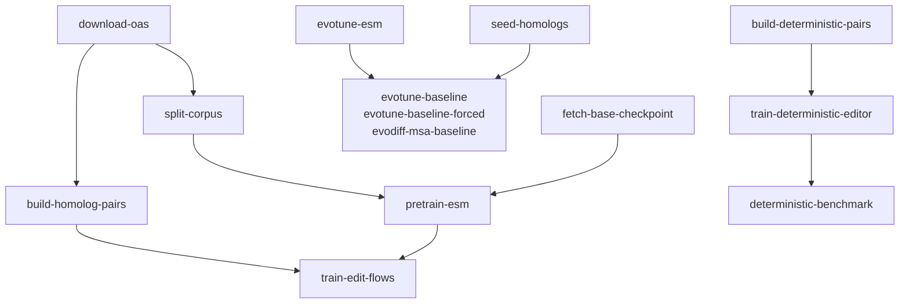

# Pipeline

The DVC DAG end to end, and what each stage produces.

One chain: the OAS corpus is downloaded, split and clustered into homolog pairs, an ESM-2 trunk is
adapted on it, and the edit-flow editor is trained on those pairs from that trunk. The Section 4.2
baselines are built alongside and scored in the same frame.

`dvc.yaml` has **14** stages; the diagram names all of them, drawing the three model-based baselines
in one box. Read `dvc.yaml` for the authoritative dependencies — this picture is for orientation,
and the Section 4.2 table itself is produced by `editjumps generation-eval`, a command rather than a
stage, over the checkpoints these stages build.

## Corpus Preprocessing Difference

The reported numbers were generated on a corpus with 370 additional sequences filtered out (0.014% of 2,587,297 total lines; see [`docs/model_cards/datasets/oas-corpus.md`](model_cards/datasets/oas-corpus.md)). A reproduction running `download-oas` directly from source processes the complete unfiltered corpus. Small numerical variations in reproduced figures may reflect this minor difference.
